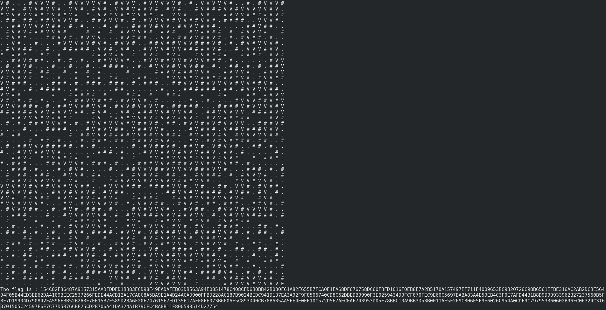

# Qiwi-Infosec CTF 2016 writeup

## Crypto 100\_1
**Category:** Crypto
**Points:** 100
**Solves:** 
**Description:**

> 52112515_4535_331534  
> 442315_321144422453_231143_543445  
> 213431313452_442315_5223244415_411112122444  
> 2533341325_2533341325_331534  
> 442315_21311122_2443_442315_4423244214_31243315

## Write-up

This challenge is short and great once you know the cipher. Here is the idea. Have you ever played Hacky Easter 2016? If so, you will remember the challenge 21, don't you?... oh yes! The Polybius Square!

Easy from now on, let's decrypt that beautiful ciphertext! I use [this](http://www.braingle.com/brainteasers/codes/polybius.php) website to decrypt it and I reformat it with Vim. I got the following

```text
wake_up_neo
the_matrix_has_you
follow_the_white_qabbit
knock_knock_neo
the_flag_is_the_third_line
```

A story about Neo... so cool?! Yep, let's focus! The flag is the third line, which means, you will have to read between lines and find out that the flag is actually 

The flag is `=> follow_the_white_qabbit`

###### with a little mistake in the word rabbit :(

## PPC\_400
**Category:** Crypto
**Points:** 400
**Solves:** 
**Description:**

> Find you way to finish  
> [File](maze.db)  

## Write-up
I did not have time to submit the flag, but here is my solution I was working on.

The challenge gave us a zipped file with [maze.db](maze.db) into it.

First of all, I run `strings maze.db` which reveals useful information like `SQLite format 3`. Happy with it, I opened the database file with the command `sqlite3 maze.db`. Then, I run `.tables`. As a result, I got three tables: start, finish and the points tables. It's maze, so we start from id 1 and end at the end 2500. Each id has coordinate in x and y, a status either a wall or a gate and I value. The following show my investigation methodology in the terminal

```sqlite3
sqlite> .tables
finish points start
sqlite> .schema
CREATE TABLE start (id integer);
CREATE TABLE finish (id integer);
CREATE TABLE points
                     (id integer primary key,
                      x integer, y integer, status varchar(10), value varchar(1));
sqlite> SELECT * FROM start;
1
sqlite> SELECT * FROM finish;
2500
sqlite> SELECT * FROM points;
1|0|0|gate|1
2|1|0|wall|B
3|2|0|gate|2
4|3|0|gate|6
5|4|0|gate|4
6|5|0|wall|1
7|6|0|gate|8
8|7|0|gate|7
...
49|48|0|gate|D
50|49|0|wall|3
51|0|1|gate|5
52|1|1|gate|4
...
2497|46|49|gate|7
2498|47|49|gate|7
2499|48|49|gate|5
2500|49|49|gate|4
sqlite> .mode csv
sqlite> .output maze.csv
sqlite> SELECT * from points;
sqlite> .quit
```

It looks like a maze 50 x 50 for a total of 2500 tiles. We start at the id of 1, coordinate (0,0) and the endpoint is at the id of 2500, coordinate (49,49). A clasic maze problem. Here is the write I wrote and the solve methods, I use the simple recursivity and A\* search from that [website](http://www.laurentluce.com/posts/solving-mazes-using-python-simple-recursivity-and-a-search/).

```python
#!/usr/bin/python2.7
class Cell:

    def __init__(self):
        self.x = 0
        self.y = 0
        self.status = ' '
        self.value = ' '

    def set_x(self, x):
        self.x = x

    def set_y(self, y):
        self.y = y

    def set_status(self, status):
        self.status = status

    def get_status(self):
        return self.status

    def set_value(self, value):
        self.value = value

    def get_value(self):
        return self.value
    
class Maze:    

    def __init__(self):
        self.flag = ""
        self.maze_x_size = 50
        self.maze_y_size = 50
        self.create_maze()
        self.solve(0, 0)

    def create_maze(self):

        self.maze = [[Cell() for x in range(self.maze_x_size)] for y in range(self.maze_y_size)]
        
        file = open("maze.csv", "r")

        for line in file:
            currentline = line.split(",")

            number = currentline[0]
            x = int(currentline[1])
            y = int(currentline[2])
            status = currentline[3]
            value = currentline[4][:-2]
            
            if status == 'gate':
                self.maze[y][x].set_status('.') 
            elif status == 'wall':
                self.maze[y][x].set_status('#')

            self.maze[y][x].set_value(value)
        
        self.maze[0][0].set_status('S')
        self.maze[self.maze_x_size-1][self.maze_y_size-1].set_status('E')
        
    def show_matrix(self):
        for i in range(self.maze_x_size):
            for j in range(self.maze_y_size):
                print self.maze[i][j].get_status(),
            print

    def solve(self,x,y):
       
        if self.maze[y][x].get_status() == 'E':
            self.flag += self.maze[y][x].get_value()
            print 'found at %d,%d' % (x, y)
            return True
        elif self.maze[y][x].get_status() == '#':
            print 'wall at %d,%d' % (x, y)
            return False
        elif self.maze[y][x].get_status() == 'V':
            print 'visited at %d,%d' % (x, y)
            return False
 
        print 'visiting %d,%d' % (x, y)

        # mark coordinate visited
        self.maze[y][x].set_status('V')        
        
        self.flag += self.maze[y][x].get_value()

        # recursive case
        if ((x < len(self.maze)-1 and self.solve(x+1, y)) or
                (y > 0 and self.solve(x, y -1)) or
                (x > 0 and self.solve(x-1, y)) or
                (y < len(self.maze)-1 and self.solve(x, y+1))):
            return True

        self.flag = self.flag[:-1]
        self.maze[y][x].set_status('.')
        return False

    def show_flag(self):
        print 'The flag is : ' +  self.flag

maze = Maze()
maze.show_matrix()
maze.show_flag()
```

My result in the terminal



The flag is `=> 154C82F36487A9157315AADFDDED1BB83ECD98E49EADAFEB03DB563A94E0851478C408CFD6B0BB42B030F61A82E655B7FCA0E1FA68DF676758DC60FBFD1016F0EB8E7A2B5170A157497EF711E4009653BC9B20726C98B6561EFBE316AC2AB2DCBE56494F05B44ED3EB62DA4109BEEC2537266FEDE44ACB12A17CA8C8A5BA9E1A4D24ACAD900FFBD228AC187B9024BEDC941D137EA3A92F9F8506740CD8C62DBEDB9990F3E0259434D9FCF070FEC9E60C5697BABA83A4E59EB4C3F0E7AFD44B1B8D9D93933962B27237560B5F8F7D19904D790842FA596FBB52B2A3F7EE15B7F589D28A6F20F747615E7ED135E17AFE8FE073B6606F5C893D40CB78B635AA5FE4E0EE10C572D5E7AECEAF743953D05F78BBC10A9BB3D53B0011AE5F269C806E5F9E6026C954A0CDF9C797953360602B96FC06324C3160701505C24597F6F7C77D5B76CBE25CD2B706A41DA324A1B79CFC4BA8B11F800593514D27754`

I'm happy to find out that I figured the solution. I recommend you to take a look at the others writeups of the same challenge.

Thanks!
